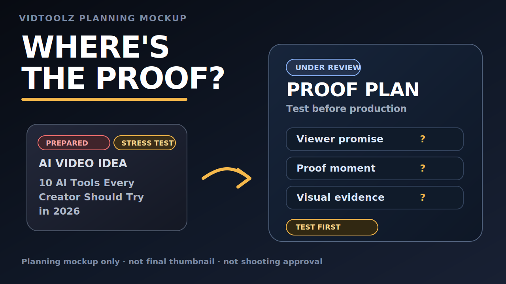

# Stop Planning AI Videos Until You Have a Proof Plan

**Run:** `2026-05-06-ai-video-proof-plan`
**Created:** 2026-05-06
**Package:** AI video proof plan before shooting
**Audience:** Serious solo creators using AI in video planning

---

## Thumbnail

**Working text:** `WHERE'S THE PROOF?`
**Concept:** Split-screen proof-plan tension layout — left side shows a prepared/stress-test weak idea, right side shows proof-plan checklist marked UNDER REVIEW.
**Status:** Draft mockup only. **Final thumbnail NOT approved.**

---

## Screenplay

**File:** [final-script.md](../package-runs/2026-05-06-ai-video-proof-plan/final-script.md) (228 lines)

**Hook:**
> Before you ask AI to write a script, ask one harder question: What will this video prove on screen?

The script walks through a concrete example: a ChatGPT prompt for AI video ideas, the prepared weak example (`10 AI Tools Every Creator Should Try in 2026`), and a proof-plan checklist that filters ideas before scripting.

**Evidence boundary (from script and notes):**
- Capture 6 is controlled/reproduced ChatGPT evidence only — not original transcript visual proof
- ChatGPT did not generate the prepared weak example
- The prepared weak example is labeled as prepared/stress-test material

---

## Done

| Date | Gate | Artifact |
|------|------|----------|
| May 6 | Package selected | `selected-package.md` |
| May 6 | Outline | `final-outline.md`, outline QA + repair |
| May 6 | Script | `final-script.md`, script QA + repair |
| May 6 | Capture | `capture-transcript.md`, `capture-verification-note.md` |
| May 6–14 | Production Prep drafts | `production-brief.md`, `shooting-plan.md`, `b-roll-list.md`, `graphics-list.md`, `resolve-edit-checklist.md` |
| May 14 | Thumbnail concept | `thumbnail-mockup.svg`, `title-thumbnail-fit-check.md` |
| May 17 | Rough cut | `rough-cut-watch-notes.md` — NEEDS PICKUPS |
| May 17 | Second-cut visual map | `second-cut-visual-support-map.md` (5 candidates) |
| May 27+ | **Resolve edit completed** | Mikko placed 7 explanatory inserts, A-roll as PiP, screen recording as base layer. **Mikko declared edit ready for publishing.** |
| May 28 | Publishing prep inventory | `publish-pack.md` populated (draft fields only) |

---

## Now

**Blocker:** No final export file exists on any filesystem Hermes can access.

The Resolve edit was completed on PRESTO (Windows). No `.mp4`, `.mov`, or export file was found on vidnux, in the package-run directory, in capture directories, or in common export paths.

**Next 30-minute action:** Mikko exports the final video from DaVinci Resolve on PRESTO to VIDNAS (`Public\VIDTOOLZ\03_SHARED_MEDIA_LIBRARY\exports\`). Hermes can then verify with `ffprobe`.

---

## Future

1. Verify export file exists and inspect with ffprobe
2. Populate `publish-pack.md`: description, pinned comment, chapters, tags
3. Mikko approves final title and final thumbnail
4. Complete publish checklist (7 items, all currently unchecked)
5. Create upload package (playlist, visibility, schedule)
6. Upload to YouTube
7. Archive run

---

## Latest verified evidence

- Resolve timeline state: 7 explanatory inserts placed, A-roll PiP bottom-right, screen recording base layer — documented in [notes.md](../package-runs/2026-05-06-ai-video-proof-plan/notes.md#L71-L95)
- Publishing prep inventory: [publish-pack.md](../package-runs/2026-05-06-ai-video-proof-plan/publish-pack.md) — all fields draft/unapproved
- Capture media: `/home/vidtoolz/Videos/vidtoolz-captures/2026-05-06-ai-video-proof-plan/20260516-capture-session-01/`

---

## Files to trust

| File | Trust |
|------|-------|
| `notes.md` | Canonical timeline. Lines 71–95 are the Resolve timeline update. |
| `publish-pack.md` | Draft metadata only. Export file field empty. |
| `final-script.md` | Completed script. Not production-approved. |
| `smallest-trustworthy-publishable-version.md` | Evidence boundary doc. Pre-edit — describes rough-cut stage, now superseded by Mikko's completed edit. |
| `STATUS.md` | **STALE.** Says "NEEDS PICKUPS" but Mikko resolved this. Do not use as current authority. |

---

*Generated 2026-05-29 from package-run artifacts. Mikko's editorial judgment is the sole quality gate.*
